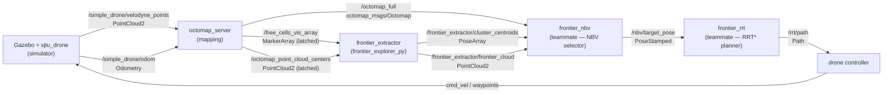

# 3D Frontier Explorer — Architecture & Data Contract

## System overview



---

## Packages

| Package | Owner | Role |
|---|---|---|
| `frontier_safety` | team | Reactive LiDAR collision avoidance (gaussian polar histogram VFH). Sits between `cmd_vel_raw` and `cmd_vel`. |
| `frontier_explorer_py` | **you** | 3D frontier extraction. Reads free/occupied cell topics from octomap_server, publishes clustered frontier viewpoint candidates. |
| `frontier_nbv` | teammate | Next-best-view selector. Raycasts predicted information gain through the OctoMap for each candidate centroid. |
| `frontier_rrt` | teammate | RRT* path planner. Builds a collision-free trajectory from current pose to the NBV target. |

---

## Data contract

### Inputs to `frontier_extractor`

| Topic | Type | Publisher | Notes |
|---|---|---|---|
| `/free_cells_vis_array` | `visualization_msgs/MarkerArray` | `octomap_server` | CUBE_LIST markers; positions in `points[]`, scale = voxel size. Requires `-p publish_free_space:=true`. Latched. |
| `/octomap_point_cloud_centers` | `sensor_msgs/PointCloud2` | `octomap_server` | Occupied voxel centres. Used to tighten the known-space boundary. Latched. |

### Outputs of `frontier_extractor`

| Topic | Type | Consumers | Description |
|---|---|---|---|
| `/frontier_extractor/frontier_cloud` | `sensor_msgs/PointCloud2` | NBV, RViz | Every frontier voxel centre. Fields: `x y z` (float32) + `cluster_id` (int32). `-1` = filtered out. |
| `/frontier_extractor/cluster_centroids` | `geometry_msgs/PoseArray` | **NBV (primary input)** | One pose per surviving cluster; position = centroid, orientation = identity. |
| `/frontier_extractor/cluster_markers` | `visualization_msgs/MarkerArray` | RViz | Coloured spheres at each centroid. Namespace `frontier_clusters`. |
| `/frontier_extractor/status` | `std_msgs/String` | monitoring | JSON `{"num_frontiers": N, "num_clusters": K}` |

### Inputs to `frontier_nbv` (teammate's contract)

| Topic | Type | Source |
|---|---|---|
| `/frontier_extractor/cluster_centroids` | `geometry_msgs/PoseArray` | frontier_extractor |
| `/frontier_extractor/frontier_cloud` | `sensor_msgs/PointCloud2` | frontier_extractor |
| `/octomap_full` | `octomap_msgs/Octomap` | octomap_server |
| `/simple_drone/odom` | `nav_msgs/Odometry` | simulator |

### Outputs of `frontier_nbv` → inputs to `frontier_rrt`

| Topic | Type | Description |
|---|---|---|
| `/nbv/target_pose` | `geometry_msgs/PoseStamped` | Selected next-best-view in the `odom` frame |

### Output of `frontier_rrt`

| Topic | Type | Description |
|---|---|---|
| `/rrt/path` | `nav_msgs/Path` | Collision-free waypoint sequence to the NBV target |

---

## Node parameters (`frontier_extractor`)

| Parameter | Default | Description |
|---|---|---|
| `free_cells_topic` | `/free_cells_vis_array` | Free-cell source from octomap_server |
| `occ_cells_topic` | `/octomap_point_cloud_centers` | Occupied-cell source from octomap_server |
| `cluster_radius` | `1.5` m | Frontier voxels within this distance merge into one cluster |
| `min_cluster_size` | `1` | Clusters smaller than this are discarded |

---

## Running the full stack

> All commands run **inside the container**: `docker compose exec ros bash`
> Source the workspace in every new shell: `source /root/ros2_ws/install/setup.bash`

### 1 — Simulator

```bash
source /root/ros2_ws/install/setup.bash
ros2 launch sjtu_drone_bringup sjtu_drone_bringup.launch.py
```

### 2 — Takeoff + static TF

```bash
source /root/ros2_ws/install/setup.bash

# Namespace is /simple_drone (set in sjtu_drone_bringup/config/drone.yaml)
ros2 topic pub /simple_drone/takeoff std_msgs/msg/Empty "{}" --once

ros2 run tf2_ros static_transform_publisher \
  0 0 0.10 0 0 0 simple_drone/base_footprint velodyne_link
```

### 3 — OctoMap server

```bash
source /root/ros2_ws/install/setup.bash
ros2 run octomap_server octomap_server_node --ros-args \
  -r cloud_in:=/simple_drone/velodyne_points \
  -p frame_id:=simple_drone/odom \
  -p resolution:=0.1 \
  -p sensor_model.max_range:=25.0 \
  -p use_sim_time:=true \
  -p publish_free_space:=true
```

### 4 — Collision avoidance

```bash
source /root/ros2_ws/install/setup.bash
ros2 launch frontier_safety collision_avoidance.launch.py
```

### 5 — Frontier extractor (build first time)

```bash
cd /root/ros2_ws
colcon build --packages-select frontier_explorer_py --symlink-install
source install/setup.bash
ros2 launch frontier_explorer_py frontier_extractor.launch.py
```

With `--symlink-install`, Python source edits are live immediately — only restart the node, no rebuild needed.

### 6 — Visualise in RViz2

Set **Fixed Frame** to `simple_drone/odom`, then add:

| Display | Topic | Tip |
|---|---|---|
| OctoMap | `/octomap_full` | `octomap_rviz_plugins` — shows 3D occupancy |
| PointCloud2 | `/frontier_extractor/frontier_cloud` | Colour by `cluster_id` field |
| MarkerArray | `/frontier_extractor/cluster_markers` | Coloured spheres at cluster centroids |
| PoseArray | `/frontier_extractor/cluster_centroids` | Viewpoint candidates for NBV |

### 7 — Drone controls (teleop)

The teleop xterm opens automatically with the simulator. Click it in the VNC desktop:

| Key | Action |
|---|---|
| `t` / `l` | Takeoff / land |
| `q` / `e` | Speed up / slow down |
| `w` / `s` | Forward / back |
| `a` / `d` | Strafe left / right |
| `r` / `f` | Rise / fall |
| `A` / `D` | Rotate |

Speed starts at 0 — press `q` a few times before moving.

---

## Algorithm notes

### Frontier extraction

A **frontier voxel** is a free voxel that has at least one unknown (never-observed) 6-face neighbour. `octomap_server` publishes free voxels as CUBE_LIST markers (`/free_cells_vis_array`); the extractor reads positions from the `points[]` array of each ADD marker.

Unknown voxels are those whose grid keys appear in neither the free set nor the occupied set.

Detection uses `np.isin` over encoded integer keys — O(N log M) — so it stays responsive as the map grows. Updates are rate-limited to 1 Hz to avoid blocking the ROS executor.

### Clustering

Greedy radius clustering: each frontier point is assigned to the nearest existing cluster centroid within `cluster_radius`. Centroids are updated with a running mean. O(N·K) where K = number of clusters. Clusters below `min_cluster_size` are discarded.

### Incremental frontier maintenance (future work)

The current implementation re-extracts frontiers from the full free-cell list on every 1 Hz tick. True incremental maintenance — only re-checking voxels in the changed sub-volume Δ𝒱ₜ — would require change-detection hooks from `octomap_server` and would scale with scan throughput rather than total map size.
